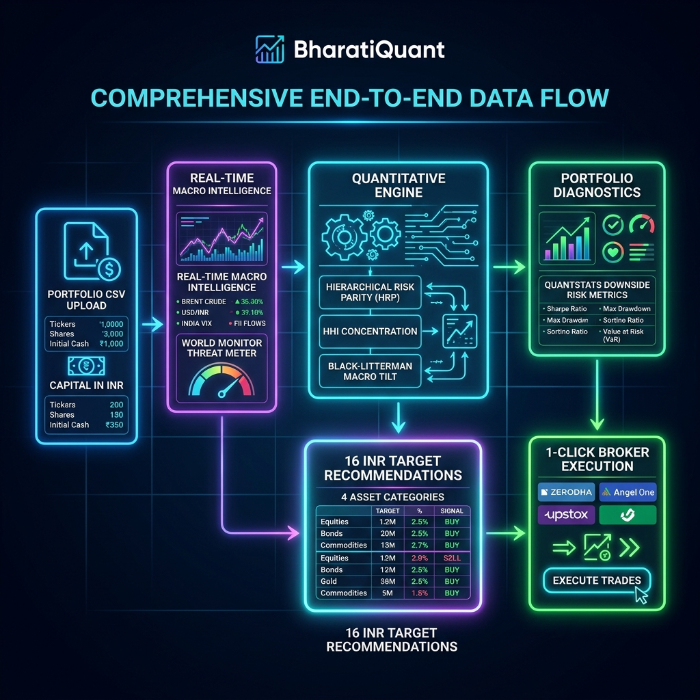
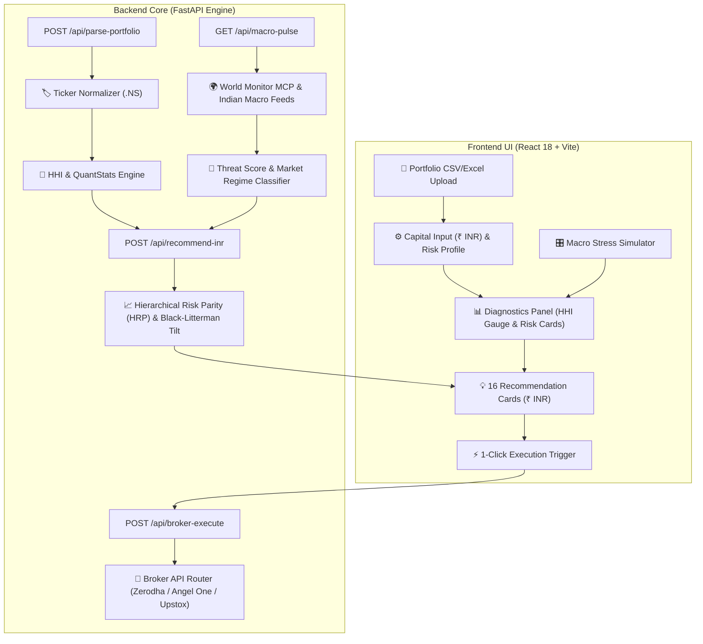

# BharatiQuant | Indian Investment Planning & Macro-Quant Platform

[](https://python.org)
[](https://fastapi.tiangolo.com)
[](https://react.dev)
[](https://vitejs.dev)
[](backend/tests)
[](LICENSE)

**BharatiQuant** is a full-stack Investment Planning & Portfolio Optimization Platform engineered specifically for Indian Financial Markets (NSE & BSE). It combines quantitative portfolio optimization algorithms (Hierarchical Risk Parity, Herfindahl-Hirschman Concentration Index, Black-Litterman Macro Tilt, PyPortfolioOpt, QuantStats) with real-time geopolitical threat feeds and Indian domestic macroeconomic drivers.

---

## 🌟 Key Features & Capabilities

### 1. Quantitative Portfolio Analytics & Downside Risk Metrics
- **Ticker Normalization**: Automatically normalizes uploaded equity & ETF tickers to standard NSE format with `.NS` suffix (e.g., `RELIANCE` → `RELIANCE.NS`, `TCS.BO` → `TCS.NS`).
- **Herfindahl-Hirschman Index ($HHI = \sum w_i^2$)**: Evaluates asset concentration risk and classifies portfolio health (Low Concentration $< 0.15$, Moderate $0.15 - 0.25$, High Concentration $> 0.25$).
- **QuantStats Downside Risk Suite**:
  - **Sortino Ratio**: Downside risk-adjusted performance metric.
  - **Calmar Ratio**: Return relative to maximum portfolio drawdown.
  - **Value at Risk ($VaR_{95\%}$)** & **Conditional VaR ($CVaR_{95\%}$)**: tail risk quantification.
  - **Max Drawdown %**: Peak-to-trough decline measurement.
- **Hierarchical Risk Parity (HRP)**: Decomposes asset covariance matrices using single-linkage hierarchical clustering and recursive bisection variance allocation to avoid matrix inversion instability.
- **Black-Litterman Macro Tilt**: Blends market equilibrium returns with geopolitical threat signals (Brent crude inflation, USD/INR FX volatility, FII net capital flows).

### 2. World Monitor & Indian Macro Intelligence
- **Geopolitical Threat Integration**: Live feeds monitoring crude oil price spikes, Middle East chokepoint alerts, GDELT tension index, and US Dollar Index (DXY).
- **Indian Domestic Context**: Real-time tracking of USD/INR exchange rate, India VIX volatility index, daily FII/DII Net institutional flows (in ₹ Cr), and RBI Repo Rate (6.50%).
- **Dynamic India Macro Threat Score (0–100)**: Real-time aggregated threat score categorizing active market regimes:
  - `HIGH_CRUDE_INFLATION_RISK` (Threat Score > 70)
  - `FII_OUTFLOW_VOLATILITY` (Threat Score 50–70)
  - `BULLISH_DOMESTIC_GROWTH` (Threat Score < 50)
  - `RISK_OFF_GOLD_FLIGHT`

### 3. Actionable INR Portfolio Recommendations
Generates **EXACTLY 16 target asset recommendations** tailored to available deployment capital in Indian Rupees (₹ INR) across 4 structured categories:
- **Category A (Rebalance & Top-up)**: Core market allocation (`NIFTYBEES.NS`, `JUNIORBEES.NS`, `MID150BEES.NS`, `RELIANCE.NS`, `HDFCBANK.NS`)
- **Category B (Uncorrelated Diversifiers)**: Safe-haven & gold hedges (`GOLDBEES.NS`, `SILVERBEES.NS`, `MON100.NS`, `BHARATBOND.NS`)
- **Category C (Systematic Alpha)**: High-conviction sector plays (`BANKBEES.NS`, `ITBEES.NS`, `TCS.NS`, `ICICIBANK.NS`)
- **Category D (Macro & Geopolitical Hedges)**: Low-volatility defensive cash equivalents (`LIQUIDBEES.NS`, `LT.NS`, `ITC.NS`)

### 4. Interactive Geopolitical Stress Simulator
- Slider-controlled macro shock simulation (Crude Oil Spike %, USD/INR Depreciation %, India VIX Spike %).
- Real-time recalculation of simulated threat score, market regime, estimated portfolio impact %, and defensive recommendations.

### 5. Indian Broker Connectivity API Layer
- 1-Click trade order routing endpoint (`POST /api/broker-execute`) with payload support for:
  - **Zerodha KiteConnect API**
  - **Angel One SmartAPI**
  - **Upstox API**

---

## 🏛️ System Architecture & Data Flow

### 📊 System Flow Infographic


### 🔄 Data Flow Diagram



### 🧱 Architecture Component Hierarchy

```
[ Frontend: React 18 + Vite ]
     │
     ├─ TopBar Component        ──> Live Macro Indicators & Threat Gauge
     ├─ Sidebar Component       ──> CSV/Excel Upload & Capital (₹ INR) Input
     ├─ DiagnosticsPanel        ──> HHI Gauge, Sector Pie Chart, Quant Risk Cards
     ├─ RecommendationPanel     ──> 16 HRP Rec Cards (INR) & 1-Click Execution
     └─ MacroSimulator Panel    ──> Interactive Stress Test Sliders
     │
     ▼ (REST APIs via Axios/Fetch)
[ Backend: FastAPI (Python 3.10+) ]
     │
     ├─ /api/macro-pulse        ──> mcp_client.py (World Monitor + Indian Macro)
     ├─ /api/parse-portfolio    ──> Ticker Normalization, HHI, Quant Diagnostics
     ├─ /api/recommend-inr      ──> quant_engine_india.py (HRP + Black-Litterman)
     ├─ /api/stress-test        ──> Macro Shock Simulation Engine
     └─ /api/broker-execute     ──> Zerodha / Angel One / Upstox Routing Layer
```

---

## 🔌 API Reference

### 1. Backend Health Check
- **`GET /`**
  - Response: `{ "status": "online", "app": "BharatiQuant Investment Platform", "market": "NSE / BSE India" }`

### 2. Macro Threat Pulse
- **`GET /api/macro-pulse`**
  - Returns real-time geopolitical threat score, market regime, Brent crude prices, USD/INR rate, India VIX, and FII net flows.

### 3. Parse Portfolio Holdings
- **`POST /api/parse-portfolio`**
  - **Multipart Form**: `file` (CSV or XLSX) or `raw_holdings` (JSON string).
  - Normalizes stock symbols, calculates portfolio total value, HHI index, sector allocation percentages, and downside risk metrics.

### 4. Generate Recommendations
- **`POST /api/recommend-inr`**
  - **Body**:
    ```json
    {
      "available_capital_inr": 500000.0,
      "risk_profile": "Moderate",
      "holdings": [{"Ticker": "RELIANCE.NS", "Quantity": 10, "Purchase Price": 2500.0}]
    }
    ```
  - Returns 16 target asset recommendations with calculated HRP weight, INR allocation, suggested share quantities, and target investment categories.

### 5. Macro Stress Testing
- **`POST /api/stress-test`**
  - **Body**:
    ```json
    {
      "crude_oil_spike_pct": 20.0,
      "usd_inr_depreciation_pct": 5.0,
      "vix_spike_pct": 35.0
    }
    ```
  - Returns simulated threat score, updated market regime, estimated portfolio value impact percentage, vulnerable sectors, and defensive asset suggestions.

### 6. Indian Broker Order Execution
- **`POST /api/broker-execute`**
  - **Body**:
    ```json
    {
      "broker_name": "Zerodha KiteConnect",
      "orders": [
        {"ticker": "NIFTYBEES.NS", "suggested_quantity": 400, "allocation_inr": 100000.0}
      ]
    }
    ```
  - Routes trade execution payload and returns queued order status summary.

---

## 📁 Repository Structure

```
InvestmentPredictor/
├── backend/
│   ├── main.py                     # FastAPI application endpoints & routing
│   ├── schemas.py                  # Pydantic data models & request/response schemas
│   ├── requirements.txt            # Python backend dependencies
│   ├── services/
│   │   ├── mcp_client.py           # World Monitor MCP & Indian macro data fetcher
│   │   └── quant_engine_india.py   # HRP, HHI, QuantStats, & INR recommendation engine
│   └── tests/
│       ├── test_quant_engine.py    # Unit tests for ticker normalization & quant metrics
│       └── test_e2e_integration.py # End-to-end integration API test suite
├── frontend/
│   ├── package.json                # Frontend npm package configuration
│   ├── vite.config.js              # Vite build configuration
│   ├── src/
│   │   ├── main.jsx                # React app entry point
│   │   ├── App.jsx                 # Main layout & component state aggregator
│   │   ├── index.css               # Glassmorphic dark design system & CSS utility classes
│   │   └── components/
│   │       ├── TopBar.jsx          # Macro pulse & market threat header bar
│   │       ├── Sidebar.jsx         # Portfolio file upload & capital setup form
│   │       ├── DiagnosticsPanel.jsx# Portfolio health gauge, HHI, & risk metric cards
│   │       ├── RecommendationPanel.jsx # 16 INR recommendation cards & broker order UI
│   │       └── MacroSimulator.jsx  # Interactive macro shock stress test panel
├── README.md                       # Comprehensive system documentation
└── tracker.md                      # Phase completion tracker & test logs
```

---

## ⚡ Quick Start & Setup Guide

### Prerequisites
- **Python**: Version 3.10 or higher
- **Node.js**: Version 18 or higher & `npm`

### 1. Backend Setup & Run

```bash
# Navigate to backend directory
cd backend

# Create virtual environment (optional but recommended)
python -m venv venv
# On Windows:
venv\Scripts\activate
# On Linux/macOS:
source venv/bin/activate

# Install backend dependencies
pip install -r requirements.txt

# Start FastAPI development server
python -m uvicorn main:app --host 0.0.0.0 --port 8000 --reload
```
API Documentation (Swagger UI): [http://localhost:8000/docs](http://localhost:8000/docs)

### 2. Frontend Setup & Run

```bash
# Open a new terminal and navigate to frontend directory
cd frontend

# Install npm packages
npm install

# Launch Vite development server
npm run dev
```
Web Dashboard: [http://localhost:5173](http://localhost:5173)

---

## 🧪 Testing & Verification

### Run Backend Unit & E2E Tests
To run all 9 backend pytest suites (ticker normalization, portfolio diagnostics, macro pulse, HRP recommendation generation, stress testing, broker routing, and E2E integration):

```bash
python -m pytest backend/tests/ -v
```
**Status**: `9 PASSED (100% pass rate)`

### Run Production Frontend Build
To verify component compilation and static asset bundler optimization:

```bash
cd frontend
npm run build
```
**Status**: `✓ Built cleanly with 0 errors`

---

## 📄 License
Distributed under the MIT License. See `LICENSE` for more information.
