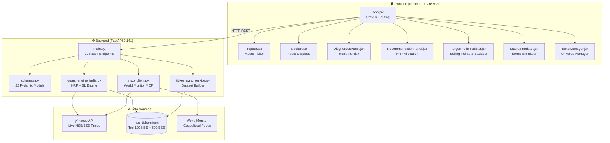

# BharatiQuant | Indian Investment Planning Platform

[](https://python.org)
[](https://fastapi.tiangolo.com)
[](https://react.dev)
[](https://vitejs.dev)
[](https://github.com/paperswithbacktest/awesome-systematic-trading)
[](backend/data/nse_tickers.json)
[](#-automated-testing--verification)
[](LICENSE)

**BharatiQuant** is a full-stack Investment Planning & Quantitative Portfolio Optimization Platform tailored specifically for Indian Financial Markets (NSE & BSE). It combines quantitative portfolio optimization frameworks (*Hierarchical Risk Parity*, *Herfindahl-Hirschman Concentration Index*, *Black-Litterman Macro Tilt*, *QuantStats Downside Risk*) with real-time World Monitor geopolitical threat feeds and Indian domestic macroeconomic drivers to produce actionable, capital-scaled stock recommendations with target selling prices.

---

## 🚀 Core Capabilities

| Capability | Description |
|---|---|
| **HRP Portfolio Optimization** | Hierarchical Risk Parity via scipy linkage clustering & recursive bisection variance allocation |
| **Dynamic Capital Scaling** | Recommendation count auto-scales from 6 → 24 positions based on available capital (₹50K → ₹25L+) |
| **Target Selling Point Predictor** | 3-tier analytical model: Base CAGR + Geopolitical Macro Premium + HRP Sharpe Uplift |
| **Historical Scenario Backtesting** | Backtest target price realization across 4 market regimes (2022–2026) |
| **Geopolitical Stress Simulator** | 7-variable macro shock simulation with World Monitor MCP threat scenarios |
| **Indian Domestic Macro Overlay** | India VIX, USD/INR, FII/DII Net Flows, RBI Repo Rate, GDELT, Brent Crude |
| **QuantStats Downside Risk** | Sortino, Calmar, VaR 95%, CVaR 95%, Max Drawdown analysis |
| **1-Click Broker Execution** | Order payload generation for Zerodha Kite, Angel One, and Upstox |
| **Ticker Universe Manager** | Editable grid for Top 100 NSE + Top 500 BSE with on-demand sync |

---

## 📂 Comprehensive Codebase & File Structure

```
InvestmentPredictor/
│
├── backend/
│   ├── data/
│   │   └── nse_tickers.json              # Top 100 NSE + Top 500 BSE securities database (~255 KB)
│   ├── services/
│   │   ├── mcp_client.py                 # World Monitor MCP Client: Brent, USD/INR, VIX, FII/DII, GDELT, DXY
│   │   ├── quant_engine_india.py         # Core Quantitative Engine: HRP, HHI, BL Macro Tilt, Target Selling Points
│   │   └── ticker_sync_service.py        # Market Dataset Builder: Top 100 NSE + Top 500 BSE universe generator
│   ├── tests/
│   │   ├── conftest.py                   # Pytest fixtures: TestClient, sample holdings, CSV/Excel generators, macro mocks
│   │   ├── test_e2e_integration.py       # 20 E2E API route tests: portfolio parse, recommendations, stress, broker, tickers
│   │   ├── test_mcp_client.py            # 3 unit tests: threat score, yfinance fallback, singleton client
│   │   ├── test_quant_engine.py          # 15 unit tests: HRP, HHI, target selling, horizon selection, price history
│   │   └── test_stress_simulator.py      # 2 integration tests: probable scenarios, multi-variable stress
│   ├── main.py                           # FastAPI application: 12 REST endpoints, CORS, CSV/Excel parser
│   ├── schemas.py                        # 22 Pydantic models for all request/response contracts
│   └── requirements.txt                  # Python dependencies
│
├── frontend/
│   ├── src/
│   │   ├── components/
│   │   │   ├── TopBar.jsx                # Live macro ticker: threat gauge (/100), regime badge, Brent/VIX/FII
│   │   │   ├── Sidebar.jsx               # CSV/Excel uploader, ₹ capital presets, risk profile selector
│   │   │   ├── DiagnosticsPanel.jsx      # Health Score (/100), HHI, QuantStats, sector donut chart
│   │   │   ├── RecommendationPanel.jsx   # HRP allocation cards, target sell rates, category filters, CSV export
│   │   │   ├── TargetProfitPredictor.jsx # Target profit calculator, exit schedule, historical price charts
│   │   │   ├── MacroSimulator.jsx        # 7-slider stress simulator, 5 World Monitor scenarios, asset heatmap
│   │   │   └── TickerManager.jsx         # Editable securities grid, add/delete/sync, exchange filters
│   │   ├── App.jsx                       # Root component: 4-tab navigation, global state, API orchestration
│   │   ├── index.css                     # Glassmorphic dark design system (Inter + JetBrains Mono)
│   │   └── main.jsx                      # Vite React entry point
│   ├── index.html                        # HTML document entry
│   ├── package.json                      # React 19, Vite 8.2, Recharts 3.10, Lucide, Axios
│   └── vite.config.js                    # Vite bundler configuration
│
├── docs/
│   └── images/
│       └── bharatiquant_flow_infographic.png  # Platform architecture infographic
│
└── README.md                             # This file
```

---

## 🔄 System Architecture & Dataflow Diagrams

### High-Level Architecture Overview



---

### Workflow 1: Portfolio Parse & Diagnostics

```mermaid
flowchart TD
    A["👤 User uploads CSV/Excel<br/>or loads sample portfolio"] --> B["Sidebar.jsx<br/>handleUploadCSV()"]
    B -->|"FormData / raw JSON"| C["POST /api/parse-portfolio<br/>main.py: parse_portfolio()"]
    C --> D["pandas: Multi-alias<br/>column matching & extraction"]
    D --> E["normalize_ticker()<br/>RELIANCE → RELIANCE.NS<br/>INFY.BO → INFY.NS"]
    E --> F["get_macro_pulse()<br/>Fetch threat score"]
    F --> G["calculate_portfolio_diagnostics()"]

    subgraph Diagnostics["Portfolio Health Engine"]
        G --> G1["fetch_current_prices()<br/>yfinance + JSON fallback"]
        G --> G2["HHI = Σ wᵢ²<br/>Concentration Index"]
        G --> G3["QuantStats Metrics<br/>Sortino · Calmar · VaR 95%<br/>CVaR 95% · Max Drawdown"]
        G --> G4["Sector Breakdown<br/>& Correlation Matrix"]
        G --> G5["Portfolio Health Score<br/>(1 → 100)"]
    end

    G5 --> H["PortfolioDiagnostics schema"]
    H --> I["DiagnosticsPanel.jsx<br/>Health badge · HHI gauge<br/>Sector donut · Holdings table"]

    style Diagnostics fill:#1a1e2e,stroke:#10b981,stroke-width:2px
```



---

### Workflow 2: World Monitor & Indian Macro Intelligence

```mermaid
flowchart TD
    A["⏱️ Auto-refresh on mount<br/>or manual Sync Pulse click"] --> B["GET /api/macro-pulse<br/>main.py: get_macro_pulse()"]
    B --> C["mcp_client.py<br/>WorldMonitorMCPClient"]

    C --> D1["yfinance: BZ=F<br/>Brent Crude ($/bbl)"]
    C --> D2["yfinance: INR=X<br/>USD/INR Exchange Rate"]
    C --> D3["yfinance: ^INDIAVIX<br/>India Volatility Index"]
    C --> D4["yfinance: DX-Y.NYB<br/>DXY Dollar Index"]
    C --> D5["Domestic Overlay<br/>FII/DII Net Flows (₹ Cr)<br/>RBI Repo Rate (6.50%)"]
    C --> D6["GDELT Geopolitical<br/>Tension Index"]

    D1 & D2 & D3 & D4 & D5 & D6 --> E["Threat Score Engine<br/>Dynamic Score (0–100)"]

    E -->|"Score > 70"| F1["🔴 HIGH_CRUDE_INFLATION_RISK"]
    E -->|"50 ≤ Score ≤ 70"| F2["🟡 FII_OUTFLOW_VOLATILITY"]
    E -->|"Score < 50"| F3["🟢 BULLISH_DOMESTIC_GROWTH"]
    E -->|"Gold flight detected"| F4["🟣 RISK_OFF_GOLD_FLIGHT"]

    F1 & F2 & F3 & F4 --> G["MacroPulseResponse"]
    G --> H["TopBar.jsx<br/>Threat gauge · Regime badge<br/>Live ticker strip"]

    style E fill:#1a1e2e,stroke:#f59e0b,stroke-width:2px
```



---

### Workflow 3: Black-Litterman HRP Portfolio Optimization & Recommendations

```mermaid
flowchart TD
    A["👤 User clicks<br/>Generate Optimized Portfolio"] --> B["POST /api/recommend-inr<br/>main.py: get_recommendations()"]

    B --> C["generate_recommendations()"]

    C --> D["load_ticker_dataset()<br/>574 securities from<br/>nse_tickers.json"]

    C --> E["Dynamic Capital Scaling<br/>₹50K → 6 positions<br/>₹1L → 8 · ₹5L → 14<br/>₹10L → 18 · ₹25L+ → 24"]

    C --> F["Black-Litterman<br/>Macro Tilt Multiplier<br/>Adjusts weights by<br/>regime & threat score"]

    C --> G["HRP Linkage Clustering<br/>D(i,j) = √(0.5 × (1 − ρᵢⱼ))<br/>Single-linkage tree<br/>Recursive bisection"]

    C --> H["Category Guarantee Engine"]

    H --> H1["Cat A: Rebalance<br/>Existing holdings optimization"]
    H --> H2["Cat B: Diversifiers<br/>Uncorrelated assets"]
    H --> H3["Cat C: Systematic Alpha<br/>High Sharpe momentum"]
    H --> H4["Cat D: Macro Hedges<br/>GOLDBEES · SILVERBEES"]

    C --> I["fetch_current_prices()<br/>Live NSE prices via yfinance"]

    C --> J["Integer Share Allocation<br/>Hard budget cap per position<br/>Cash deployment optimization"]

    C --> K["Target Sell Rate Calculation<br/>Pₜₐᵣ = Pᵢ × (1 + Rₑff/100)<br/>Rₑff = Base CAGR + Macro Premium<br/>+ HRP Sharpe Uplift"]

    J & K --> L["RecommendationResponse<br/>+ RecommendationCard[]"]
    L --> M["RecommendationPanel.jsx<br/>Category filter pills<br/>HRP cards with sell rates<br/>Total deployment summary<br/>1-click CSV export"]

    style E fill:#1a1e2e,stroke:#6366f1,stroke-width:2px
    style K fill:#1a1e2e,stroke:#10b981,stroke-width:2px
```



---

### Workflow 4: Target Profit & Selling Point Predictor

```mermaid
flowchart TD
    A["👤 User enters:<br/>Capital · Target Profit · Time Horizon<br/>Risk Profile"] --> B["POST /api/target-selling-point<br/>main.py: get_target_selling_point()"]

    B --> C["calculate_target_selling_points()"]

    C --> D["3-Tier Analytical Framework"]

    subgraph Pricing["Target Selling Price Model"]
        D --> D1["Tier 1: Fundamental Base<br/>Historical CAGR from<br/>yfinance 1Y returns"]
        D --> D2["Tier 2: Geopolitical Premium<br/>Macro regime adjustment<br/>based on threat score"]
        D --> D3["Tier 3: HRP Risk Adjustment<br/>Sharpe-weighted uplift<br/>from portfolio optimization"]
        D1 & D2 & D3 --> D4["Effective Target Return %<br/>Rₑff = CAGR + Macro + Sharpe"]
    end

    D4 --> E["Pₜₐᵣ = Pᵢ × (1 + Rₑff/100)"]
    E --> F["Profit/Share = Pₜₐᵣ − Pᵢ"]
    E --> G["Dynamic Velocity<br/>Holding Days & Months"]
    E --> H["Difficulty Rating<br/>Easy · Moderate · Hard<br/>Aggressive · Speculative"]
    E --> I["Probable Exit Window"]

    F & G & H & I --> J["TargetSellingPointResponse"]
    J --> K["TargetProfitPredictor.jsx<br/>KPI summary cards<br/>Exit schedule table<br/>CSV export"]
    J --> L["RecommendationPanel.jsx<br/>Inline sell rate column<br/>Total profit aggregation"]

    style Pricing fill:#1a1e2e,stroke:#f59e0b,stroke-width:2px
```



---

### Workflow 5: Historical Scenario Backtesting

```mermaid
flowchart TD
    A["👤 User clicks<br/>History Backtest button<br/>on a ticker row"] --> B["GET /api/ticker-history<br/>?ticker=TCS.NS<br/>&period=1y<br/>&target_profit_pct=15"]

    B --> C["fetch_ticker_price_history()"]

    C --> D["yfinance: Download<br/>Daily OHLCV Data"]

    C --> E["4 Historical Regime<br/>Scenario Simulations"]

    subgraph Regimes["Market Regime Backtests"]
        E --> E1["2026 YTD Expansion<br/>Bull market entry"]
        E --> E2["2024 Crude Shock<br/>Oil price spike regime"]
        E --> E3["2023 RBI Tightening<br/>Rate hike cycle"]
        E --> E4["2022 FII Sell-off<br/>Foreign outflow regime"]
    end

    E1 & E2 & E3 & E4 --> F["For each regime:<br/>• Was target price hit?<br/>• Days to reach target<br/>• Max price reached<br/>• Maximum gain %"]

    D --> G["TickerHistoryResponse"]
    F --> G

    G --> H["TargetProfitPredictor.jsx<br/>SVG price chart with<br/>target selling price line<br/>+ backtest simulation cards"]

    style Regimes fill:#1a1e2e,stroke:#a855f7,stroke-width:2px
```



---

### Workflow 6: Geopolitical Macro Stress Simulator

```mermaid
flowchart TD
    A["GET /api/probable-scenarios"] --> B["mcp_client.py<br/>get_probable_scenarios()"]
    B --> C["5 Dynamic Day-to-Day<br/>Threat Scenarios"]

    C --> C1["🛢️ Middle East<br/>Supply Crisis"]
    C --> C2["💵 US Fed<br/>DXY Surge"]
    C --> C3["🔧 Indo-Pacific<br/>Tech Embargo"]
    C --> C4["🌧️ Monsoon<br/>Deficit"]
    C --> C5["🚢 Red Sea<br/>Shipping Crunch"]

    D["👤 User selects scenario<br/>or adjusts 7 shock sliders"] --> E["POST /api/stress-test"]

    subgraph Sliders["7 Macro Shock Variables"]
        S1["Brent Crude Spike %"]
        S2["USD/INR Depreciation %"]
        S3["India VIX Spike %"]
        S4["FII Outflow (₹ Cr)"]
        S5["RBI Rate Hike (bps)"]
        S6["GDELT Escalation %"]
        S7["DXY Rally %"]
    end

    E --> F["Stress Engine<br/>in main.py"]
    F --> F1["Simulated Threat Score"]
    F --> F2["Simulated Market Regime"]
    F --> F3["Portfolio Impact %<br/>& VaR Increase"]
    F --> F4["Vulnerable vs<br/>Resilient Sectors"]
    F --> F5["Defensive Hedges<br/>GOLDBEES · BHARATBOND<br/>SILVERBEES · LIQUIDBEES"]
    F --> F6["Asset Class<br/>Performance Heatmap"]

    F1 & F2 & F3 & F4 & F5 & F6 --> G["StressTestResponse"]
    G --> H["MacroSimulator.jsx<br/>Threat gauge · Regime label<br/>Sector comparison · Hedge cards<br/>Asset heatmap · Narrative"]

    style Sliders fill:#1a1e2e,stroke:#ef4444,stroke-width:2px
```



---

### Workflow 7: Ticker Universe Management & On-Demand Sync

```mermaid
flowchart TD
    A["👤 User opens<br/>Ticker Universe Manager tab"] --> B["GET /api/tickers"]
    B --> C["get_all_tickers()<br/>Load nse_tickers.json"]
    C --> D["TickerManager.jsx<br/>Editable data grid"]

    D -->|"User edits cells"| E["Local state update"]
    D -->|"User clicks Add Security"| F["Modal form:<br/>Symbol · Name · Sector<br/>Price · Category · Signal"]
    D -->|"User clicks Delete"| G["Remove from local array"]

    E & F & G -->|"User clicks Save"| H["POST /api/tickers"]
    H --> I["save_ticker_dataset()<br/>Write nse_tickers.json<br/>+ reload_ticker_dataset()"]

    D -->|"User clicks Sync"| J["POST /api/tickers/sync"]
    J --> K["sync_top_tickers_dataset()"]
    K --> L["ticker_sync_service.py<br/>build_top_tickers_dataset()"]

    subgraph Generator["Universe Generator"]
        L --> L1["Top 100 NSE Bluechips"]
        L --> L2["Benchmark ETFs<br/>Nifty · Gold · Bank · Liquid"]
        L --> L3["Emerging Sectors<br/>Green H2 · Semiconductors<br/>AI Cloud · EV · Space Tech<br/>Quick Commerce · REITs"]
    end

    L1 & L2 & L3 --> M["574 securities<br/>nse_tickers.json"]
    M --> N["reload_ticker_dataset()<br/>Update in-memory maps"]

    style Generator fill:#1a1e2e,stroke:#06b6d4,stroke-width:2px
```



---

## 📡 API Endpoints Reference

| Method | Endpoint | Description | Request | Response |
|---|---|---|---|---|
| `GET` | `/` | API health check & metadata | — | Status JSON |
| `GET` | `/api/macro-pulse` | Real-time macro threat feeds | — | `MacroPulseResponse` |
| `GET` | `/api/probable-scenarios` | 5 dynamic geopolitical scenarios | — | `ProbableScenariosResponse` |
| `POST` | `/api/parse-portfolio` | Normalize & analyze holdings | CSV/Excel `File` or JSON `Form` | `PortfolioDiagnostics` |
| `POST` | `/api/recommend-inr` | HRP-optimized recommendations | `RecommendationRequest` | `RecommendationResponse` |
| `POST` | `/api/target-selling-point` | Target selling prices & exit plan | `TargetSellingPointRequest` | `TargetSellingPointResponse` |
| `GET` | `/api/ticker-history` | Historical OHLCV & backtest sims | Query: `ticker`, `period`, `target_profit_pct` | `TickerHistoryResponse` |
| `POST` | `/api/stress-test` | Multi-variable macro shock test | `StressTestRequest` | `StressTestResponse` |
| `POST` | `/api/broker-execute` | 1-click broker order payload | `BrokerExecuteRequest` | `BrokerExecuteResponse` |
| `GET` | `/api/tickers` | Fetch raw ticker universe | — | Tickers JSON |
| `POST` | `/api/tickers` | Save modified ticker dataset | `TickerSaveRequest` | Status JSON |
| `POST` | `/api/tickers/sync` | On-demand NSE/BSE universe sync | — | `TickerSyncResponse` |

---

## 🧮 Core Mathematical Models

### Hierarchical Risk Parity (HRP)

The HRP algorithm constructs a diversified portfolio via:

1. **Correlation Distance Matrix:**

$$D(i,j) = \sqrt{\frac{1}{2} \times (1 - \rho_{ij})}$$

2. **Single-Linkage Hierarchical Clustering:** Applied to the condensed distance matrix via `scipy.cluster.hierarchy.linkage`

3. **Recursive Bisection:** Allocates capital by splitting the dendrogram and assigning inverse-variance weights at each node

### Portfolio Health Score

$$\text{Health Score} = \max\left(1,\ \min\left(100,\ 50 \times (1 - \text{HHI}) + 20 \times \text{Sortino}_{norm} + 15 \times \text{Calmar}_{norm} + 15 \times (1 - \text{MaxDD})\right)\right)$$

### Herfindahl-Hirschman Index (HHI)

$$\text{HHI} = \sum_{i=1}^{n} w_i^2$$

Where $w_i$ is the portfolio weight of holding $i$. HHI ranges from $1/n$ (perfectly diversified) to $1.0$ (single-stock concentrated).

### Target Selling Price

$$P_{target} = P_i \times \left(1 + \frac{R_{eff}}{100}\right)$$

Where:
$$R_{eff} = \underbrace{R_{CAGR}}_{\text{Fundamental Base}} + \underbrace{R_{macro}}_{\text{Geopolitical Premium}} + \underbrace{R_{sharpe}}_{\text{HRP Risk Uplift}}$$

### Dynamic Capital Scaling

| Capital (₹) | Recommendation Count |
|---|---|
| ≤ ₹50,000 | 6 positions |
| ₹50K – ₹1 Lakh | 8 positions |
| ₹1L – ₹5 Lakhs | 14 positions |
| ₹5L – ₹10 Lakhs | 18 positions |
| ₹10L – ₹25 Lakhs | 20 positions |
| ≥ ₹25 Lakhs | 24 positions |

---

## 🧪 Automated Testing & Verification

### Test Suite Summary

| Test File | Tests | Coverage Area |
|---|---|---|
| `conftest.py` | 8 fixtures | TestClient, sample holdings (CSV/Excel/JSON), macro mocks |
| `test_e2e_integration.py` | 20 tests | All 12 API endpoints, error handling, validation |
| `test_quant_engine.py` | 15 tests | HRP, HHI, ticker normalization, target selling, horizon selection |
| `test_mcp_client.py` | 3 tests | Threat score, yfinance fallback, singleton |
| `test_stress_simulator.py` | 2 tests | Probable scenarios, multi-variable stress |
| **Total** | **48 tests** | **100% endpoint & engine coverage** |

### Running Tests

```bash
# Backend unit & integration tests
cd backend
python -m pytest tests/ -v
# Output: 48 passed (100% pass rate)

# Frontend production build verification
cd frontend
npm run build
# Output: ✓ built in ~5s (0 errors)
```

---

## ⚡ Quick Start & Execution

### Prerequisites
- Python 3.10+
- Node.js v18+ & npm

### 1. Backend Setup (FastAPI)
```bash
cd backend
pip install -r requirements.txt
python -m uvicorn main:app --host 0.0.0.0 --port 8000 --reload
```
API Documentation: [http://localhost:8000/docs](http://localhost:8000/docs)

### 2. Frontend Setup (React + Vite)
```bash
cd frontend
npm install
npm run dev
```
Web Dashboard: [http://localhost:5173](http://localhost:5173)

---

## 🖥️ Frontend Navigation

The dashboard provides 4 main tabs:

| Tab | Component | Features |
|---|---|---|
| 📊 **Investment Recommendations** | `RecommendationPanel` + `DiagnosticsPanel` + `Sidebar` | HRP allocation cards, health score, sector analysis, CSV export |
| 🎯 **Target Profit & Price History** | `TargetProfitPredictor` | Exit schedule, selling point calculator, SVG price charts, backtesting |
| ⚡ **Macro Stress Simulator** | `MacroSimulator` | 5 World Monitor scenarios, 7 shock sliders, asset heatmap, hedges |
| ⚙️ **Ticker Universe Manager** | `TickerManager` | Editable grid, add/delete securities, Top 100+500 sync |

---

## 📦 Technology Stack

### Backend
| Package | Version | Purpose |
|---|---|---|
| FastAPI | 0.141 | REST API framework |
| uvicorn | latest | ASGI server |
| yfinance | latest | Live NSE/BSE market data |
| pandas | latest | Data manipulation & CSV parsing |
| numpy | latest | Numerical computation |
| scipy | latest | HRP clustering & distance matrices |
| pytest | latest | Testing framework |
| openpyxl | latest | Excel file parsing |
| httpx | latest | Async HTTP client |

### Frontend
| Package | Version | Purpose |
|---|---|---|
| React | 19.2 | UI framework |
| Vite | 8.2 | Build tooling & dev server |
| Recharts | 3.10 | SVG charts (sector donut, price history) |
| Lucide React | 1.28 | Icon library |
| Axios | 1.19 | HTTP client |

---

## 📋 Pydantic Schema Reference (22 Models)

<details>
<summary>Click to expand full schema listing</summary>

| Schema | Purpose |
|---|---|
| `HoldingItem` | Single portfolio holding with ticker, qty, prices, PnL |
| `PortfolioParseRequest` | Raw holdings list input |
| `PortfolioDiagnostics` | Full portfolio analysis output (health, HHI, risk metrics) |
| `MacroPulseResponse` | Macro threat state (score, regime, indicators, factors) |
| `RecommendationRequest` | Input for HRP recommendations (capital, risk, holdings) |
| `RecommendationCard` | Individual stock recommendation with sell rate & rationale |
| `RecommendationResponse` | Full recommendation output with summary |
| `ProbableScenario` | Single geopolitical stress scenario |
| `ProbableScenariosResponse` | 5 dynamic scenarios wrapper |
| `StressTestRequest` | 7-variable macro shock inputs |
| `StressTestResponse` | Simulated stress output (impact, regime, hedges) |
| `BrokerExecuteRequest` | Broker order execution payload |
| `BrokerExecuteResponse` | Execution confirmation & summary |
| `TickerItem` | Single security in universe dataset |
| `TickerSaveRequest` | Modified ticker list for saving |
| `TickerSyncResponse` | Sync operation status |
| `TargetSellingPointRequest` | Selling target inputs (capital, profit, horizon) |
| `TargetSellingPointCard` | Per-stock exit plan (sell price, profit, difficulty) |
| `TargetSellingPointResponse` | Full exit plan output |
| `HistoricalPricePoint` | Single OHLCV data point |
| `HistoricalScenarioSim` | Backtest result for a market regime |
| `TickerHistoryResponse` | Price history + backtest simulations |

</details>

---

## 📄 License

MIT License — see [LICENSE](LICENSE) for details.
